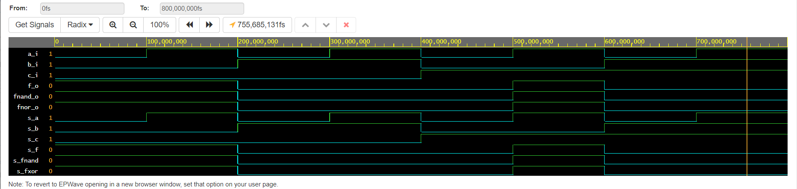
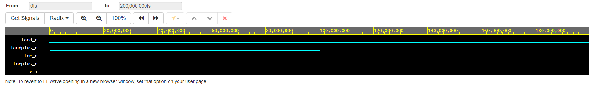
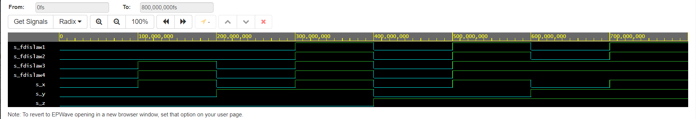

# Digital-eletronics-1

## Labs

### Domácí práce z 1. cvičení
*Příklad textu psaný kurzívou.* **Text psaný tučným písmem.** ***Kombinace obou metod.***    ~~Chybný text.~~

1. Potraviny
2. Kosmetika
3. Oblečení
     1. Mikina
      2. Tričko
      3. Vesta
* Převést zboží
* Koupit nářadí
  * šroubovák
  * kladivo
  
 #### 1.
 Odkaz na můj [GitHub](https://github.com/milan-drahozal).


### **Source code**

```vhdl
------------------------------------------------------------------------

library ieee;               -- Standard library
use ieee.std_logic_1164.all;-- Package for data types and logic operations

------------------------------------------------------------------------
-- Entity declaration for basic gates
------------------------------------------------------------------------
entity gates is
    port(
        a_i     : in  std_logic;        -- Data input
        b_i     : in  std_logic;        -- Data input
        c_i     : in  std_logic;        -- Data input
        f_o     : out std_logic;        -- OR output function
        fnand_o : out std_logic;        -- NAND output function
        fnor_o : out std_logic          -- NOR output function
    );
end entity gates;

------------------------------------------------------------------------
-- Architecture body for basic gates
------------------------------------------------------------------------
architecture dataflow of gates is
begin
    f_o  <= ((not b_i) and a_i) or ((not b_i) and (not c_i));
    fnand_o <= not(not(a_i and not(b_i)) and not(not b_i and not c_i));
    fnor_o <= not(not(a_i or not c_i) or b_i);

end architecture dataflow;
```

#### EDA playground
Odkaz na simulátor [EDAplayground](https://edaplayground.com/x/DjZa)
  
| c | b | a | f(c,b,a,)| f(c,b,a,)nand| f(c,b,a,)nor|
|---|---|---|----------|--------------|-------------|
| 0 | 0 | 0 |    1     |       1      |      1      |
| 0 | 0 | 1 |    1     |       1      |      1      |
| 0 | 1 | 0 |    0     |       0      |      0      | 
| 0 | 1 | 1 |    0     |       0      |      0      |
| 1 | 0 | 0 |    0     |       0      |      0      |
| 1 | 0 | 1 |    1     |       1      |      1      |
| 1 | 1 | 0 |    0     |       0      |      0      |
| 1 | 1 | 1 |    0     |       0      |      0      |



### **Source code 1. Experiment**

#### The Verification of Basic Boolean Postulates

```vhdl
------------------------------------------------------------------------

library ieee;               -- Standard library
use ieee.std_logic_1164.all;-- Package for data types and logic operations

------------------------------------------------------------------------
-- Entity declaration for basic gates
------------------------------------------------------------------------
entity gates is
    port(
        x_i        : in  std_logic;         -- Data input
        fand_o     : out std_logic;         -- OR output function
        for_o      : out std_logic;         -- AND output function
        forplus_o  : out std_logic;          -- XOR output function
        fandplus_o : out std_logic  
    );
end entity gates;

------------------------------------------------------------------------
-- Architecture body for basic gates
------------------------------------------------------------------------
architecture dataflow of gates is
begin
    fand_o     <= x_i and not x_i;
    for_o      <= x_i or not x_i;
    forplus_o  <= x_i or x_i or x_i;
    fandplus_o <= x_i and x_i and x_i;

end architecture dataflow;

```
Odkaz na simulátor 1. experimentu [EDA playground](https://www.edaplayground.com/x/cBis)



**Source code 2. Experiment**


#### The Verify of Distributive Laws

```vhdl
------------------------------------------------------------------------

library ieee;               -- Standard library
use ieee.std_logic_1164.all;-- Package for data types and logic operations

------------------------------------------------------------------------
-- Entity declaration for basic gates
------------------------------------------------------------------------
entity gates is
    port(
        a_i    : in  std_logic;         -- Data input
        b_i    : in  std_logic;         -- Data input
        for_o  : out std_logic;         -- OR output function
        fand_o : out std_logic;         -- AND output function
        fxor_o : out std_logic          -- XOR output function
    );
end entity gates;

------------------------------------------------------------------------
-- Architecture body for basic gates
------------------------------------------------------------------------
architecture dataflow of gates is
begin
    for_o  <= a_i or b_i;
    fand_o <= a_i and b_i;
    fxor_o <= a_i xor b_i;

end architecture dataflow;
```
#### EDA playground
Odkaz na simulátor 2. experimentu [EDA playground](https://www.edaplayground.com/x/E9xv)


