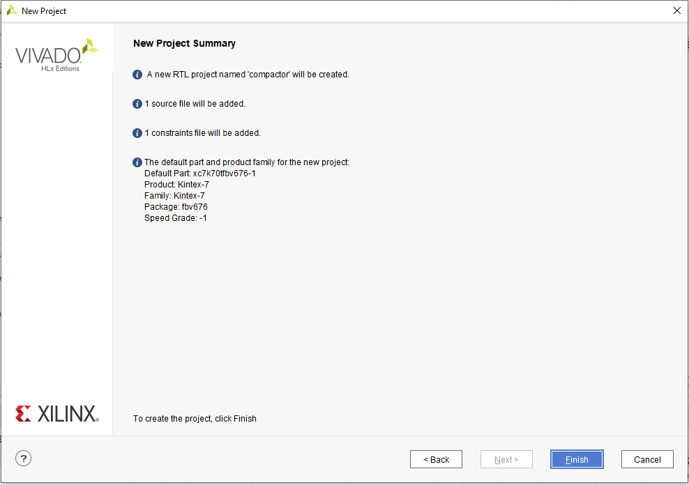

# Digital-eletronics-1

## Labs

### Domácí práce z 3. cvičení

### 1. Figure or table with connection of 16 slide switches and 16 LEDs on Nexys A7 board.

| **LED** | **Connection** | **Switch** | **Connection** | 
| :-: | :-: | :-: | :-: |
| LED0 | H17 | SW0 | J15 |
| LED1 | K15 | SW1 | L16 |
| LED2 | J13 | SW2 | M13 |
| LED3 | N14 | SW3 | R15 |
| LED4 | R18 | SW4 | R17 |
| LED5 | V17 | SW5 | T18 |
| LED6 | U17 | SW6 | U18 |
| LED7 | U16 | SW7 | R13 |
| LED8 | V16 | SW8 | T8 |
| LED9 | T15 | SW9 | U8 |
| LED10 | U14 | SW10 | R16 |
| LED11 | T16 | SW11 | T13 |
| LED12 | V15 | SW12 | H6 |
| LED13 | V14 | SW13 | U12 |
| LED14 | V12 | SW14 | U11 |
| LED15 | V11 | SW15 | V10 |

### 2. Two-bit wide 4-to-1 multiplexer. Submit:

* Listing of VHDL architecture from source file `mux_2bit_4to1.vhd` with syntax highlighting,

```vhdl
architecture Behavioral of mux_2bit_4to1 is
begin

    f_o  <= a_i when (sel_i = "00") else 
            b_i when (sel_i = "01") else
            c_i when (sel_i = "10") else
            d_i;


    -- WRITE "GREATER" AND "EQUALS" ASSIGNMENTS HERE


end architecture Behavioral;¨
```
* Listing of VHDL stimulus process from testbench file `tb_mux_2bit_4to1.vhd` with syntax highlighting,

```vhdl
p_stimulus : process
    begin
        -- Report a note at the begining of stimulus process
        report "Stimulus process started" severity note;


        -- First test values
        s_d <= "00"; s_c <= "00"; s_b <= "00"; s_a <= "00";
        s_sel <= "00"; wait for 100 ns;
        
          -- Second test values
        s_d <= "00"; s_c <= "01"; s_b <= "01"; s_a <= "11";
        s_sel <= "00"; wait for 100 ns;
        
          -- Third test values
        s_d <= "10"; s_c <= "01"; s_b <= "01"; s_a <= "11";
        s_sel <= "10"; wait for 100 ns;
      
        -- Fourth test values
        s_d <= "10"; s_c <= "01"; s_b <= "01"; s_a <= "00";
        s_sel <= "10"; wait for 100 ns;
        
          -- Fifth test values
        s_d <= "10"; s_c <= "00"; s_b <= "10"; s_a <= "00";
        s_sel <= "01"; wait for 100 ns;
        
         -- Sixth test values
        s_d <= "10"; s_c <= "10"; s_b <= "11"; s_a <= "00";
        s_sel <= "01"; wait for 100 ns;
        
         -- Seventh test values
        s_d <= "00"; s_c <= "01"; s_b <= "11"; s_a <= "00";
        s_sel <= "11"; wait for 100 ns;

         -- Eighth test values
        s_d <= "01"; s_c <= "01"; s_b <= "11"; s_a <= "00";
        s_sel <= "11"; wait for 100 ns;
        
         -- Ninth test values
        s_d <= "10"; s_c <= "01"; s_b <= "11"; s_a <= "10";
        s_sel <= "00"; wait for 100 ns;
        
         -- Tenth test values
        s_d <= "10"; s_c <= "01"; s_b <= "11"; s_a <= "00";
        s_sel <= "11"; wait for 100 ns;
        
        -- Report a note at the end of stimulus process
        report "Stimulus process finished" severity note;
        wait;
    end process p_stimulus;
```
* Screenshot with simulated time waveforms; always display all inputs and outputs.


### 3. A Vivado tutorial. Submit:
#### Postup k vytvoření projektu
**File > Project > New**
* Po té se proklikám k oknu, kde nastavím jméno projektu a umístění projektu

#### Takto nastavíme typ projektu

#### Postup přidání source file
Je nutné nastavit jazyk VHDL

#### Následně se vytváří Constraints file
Prvně se vytvoří prázdný dokument

#### V dalším kroku je nutné vybrat desku
Volíme předdefinovanou desku Nexys A7-50T

**Na závěr se nám vypíše tabulka shrnující nastavení projektu**



#### Postup přidání testbench souboru
**File > Add Sources**
A vybereme následující možnost.


#### Následně vytvoříme Simulation Source file a vybereme jazyk VHDL

#### Není nutné definovat porty na desce, proto pokračujeme bez změny


#### Postup pro spuštění simulace


#### Do vytvořeného Constraints file zkopírujeme soubor z GitHubu

