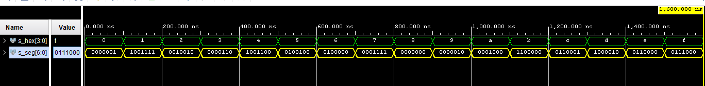
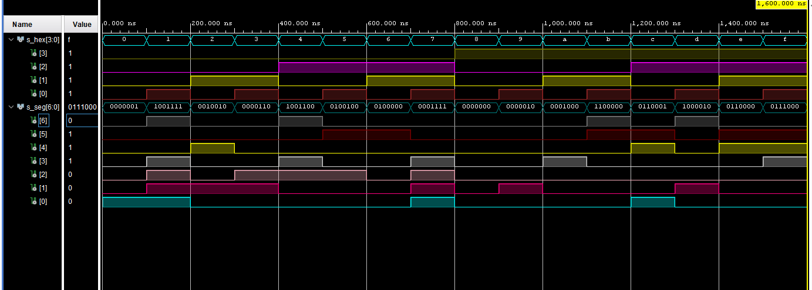
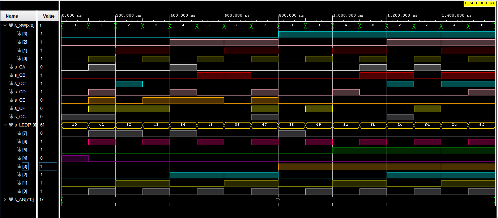

# Digital-eletronics-1

## Labs

### Domácí práce ze 4. cvičení

### 1. Preparation tasks (done before the lab at home). Submit:

* Figure or table with connection of 7-segment displays on Nexys A7 board

| Hex | Inputs | A | B | C | D | E | F | G |
| :-: | :-: | :-: | :-: | :-: | :-: | :-: | :-: | :-: |
| 0 | 0000 | 0 | 0 | 0 | 0 | 0 | 0 | 1 |
| 1 | 0001 | 1 | 0 | 0 | 1 | 1 | 1 | 1 |
| 2 | 0010 | 0 | 0 | 1 | 0 | 0 | 1 | 0 |
| 3 | 0011 | 0 | 0 | 0 | 0 | 1 | 1 | 0 |
| 4 | 0100 | 1 | 0 | 0 | 1 | 1 | 0 | 0 |
| 5 | 0101 | 0 | 1 | 0 | 0 | 1 | 0 | 0 |
| 6 | 0110 | 0 | 1 | 0 | 0 | 0 | 0 | 0 |
| 7 | 0111 | 0 | 0 | 0 | 1 | 1 | 1 | 1 |
| 8 | 1000 | 0 | 0 | 0 | 0 | 0 | 0 | 0 |
| 9 | 1001 | 0 | 0 | 0 | 0 | 0 | 1 | 0 |
| A | 1010 | 0 | 0 | 0 | 1 | 0 | 0 | 0 |
| B | 1011 | 1 | 1 | 0 | 0 | 0 | 0 | 0 |
| C | 1100 | 0 | 1 | 1 | 0 | 0 | 0 | 1 |
| D | 1101 | 1 | 0 | 0 | 0 | 0 | 1 | 0 |
| E | 1110 | 0 | 1 | 1 | 0 | 0 | 0 | 0 |
| F | 1111 | 0 | 1 | 1 | 1 | 0 | 0 | 0 |

* Decoder truth table for common anode 7-segment display.



### 2. Seven-segment display decoder. Submit:
* Listing of VHDL architecture from source file hex_7seg.vhd with syntax highlighting
```vhdl
architecture Behavioral of hex_7seg is

begin
--source code, podle všeho správně

    p_7seg_decoder : process(hex_i)
    begin
        case hex_i is --Klasický case
            when "0000" =>
                seg_o <= "0000001";     -- 0
            when "0001" =>
                seg_o <= "1001111";     -- 1
            when "0010" =>
                seg_o <= "0010010";     -- 2
            when "0011" =>
                seg_o <= "0000110";     -- 3
            when "0100" =>
                seg_o <= "1001100";     -- 4
            when "0101" =>
                seg_o <= "0100100";     -- 5
            when "0110" =>
                seg_o <= "0100000";     -- 6
            when "0111" =>
                seg_o <= "0001111";     -- 7
            when "1000" =>
                seg_o <= "0000000";     -- 8
            when "1001" =>
                seg_o <= "0000010";     -- 9
            when "1010" =>
                seg_o <= "0001000";     -- A (10)
            when "1011" =>
                seg_o <= "1100000";     -- B (11)
            when "1100" =>
                seg_o <= "0110001";     -- C (12)
            when "1101" =>
                seg_o <= "1000010";     -- D (13)
            when "1110" =>
                seg_o <= "0110000";     -- E (14)
            when others =>
                seg_o <= "0111000";     -- F (15) 
        end case;
    end process p_7seg_decoder;

end Behavioral;
```
* Listing of VHDL stimulus process from testbench file tb_mux_2bit_4to1.vhd with syntax highlighting and asserts
```vhdl
p_stimulus : process
    begin
        -- Report a note at the begining of stimulus process
        report "Stimulus process started" severity note;

        s_hex <= "0000"; wait for 100 ns;   -- 0
        
        s_hex <= "0001"; wait for 100 ns;   -- 1
           
        s_hex <= "0010"; wait for 100 ns;   -- 2
        
        s_hex <= "0011"; wait for 100 ns;   -- 3 
        
        s_hex <= "0100"; wait for 100 ns;   -- 4
           
        s_hex <= "0101"; wait for 100 ns;   -- 5
        
        s_hex <= "0110"; wait for 100 ns;   -- 6
        
        s_hex <= "0111"; wait for 100 ns;   -- 7
           
        s_hex <= "1000"; wait for 100 ns;   -- 8
        
        s_hex <= "1001"; wait for 100 ns;   -- 9
        
        s_hex <= "1010"; wait for 100 ns;   -- A
        
        s_hex <= "1011"; wait for 100 ns;   -- B
           
        s_hex <= "1100"; wait for 100 ns;   -- C
        
        s_hex <= "1101"; wait for 100 ns;   -- D
        
        s_hex <= "1110"; wait for 100 ns;   -- E
        
        s_hex <= "1111"; wait for 100 ns;   -- F
        
        -- Report a note at the end of stimulus process
        report "Stimulus process finished" severity note;
        wait;
    end process p_stimulus;

```

* Screenshot with simulated time waveforms; always display all inputs and outputs.



### 3. LED(7:4) indicators. Submit:
* Truth table and listing of VHDL code for LEDs(7:4) with syntax highlighting

| Hex | Inputs | LED4 | LED5 | LED6 | LED7 |
| :-: | :-: | :-: | :-: | :-: | :-: |
| 0 | 0000 | **1** | 0 | 0 | 0 |
| 1 | 0001 | 0 | 0 | **1** | **1** |
| 2 | 0010 | 0 | 0 | 0 | **1** |
| 3 | 0011 | 0 | 0 | **1** | 0 |
| 4 | 0100 | 0 | 0 | 0 | **1** |
| 5 | 0101 | 0 | 0 | **1** | 0 |
| 6 | 0110 | 0 | 0 | 0 | 0 |
| 7 | 0111 | 0 | 0 | **1** | 0 |
| 8 | 1000 | 0 | 0 | 0 | **1** |
| 9 | 1001 | 0 | 0 | **1** | 0 |
| A | 1010 | 0 | **1** | 0 | 0 |
| B | 1011 | 0 | **1** | **1** | 0 |
| C | 1100 | 0 | **1** | 0 | 0 |
| D | 1101 | 0 | **1** | **1** | 0 |
| E | 1110 | 0 | **1** | 0 | 0 |
| F | 1111 | 0 | **1** | **1** | 0 |

```vhdl
-- LED(7:4) indicators
    -- Turn LED(4) on if input value is equal to 0, ie "0000"
        LED(4)  <= '1' when (SW = "0000") else '0';
    
    -- Turn LED(5) on if input value is greater than "1001", ie 9
         LED(5)  <= '1' when (SW > "1001") else '0';
    
    -- Turn LED(6) on if input value is odd, ie 1, 3, 5, ...
         LED(6) <= '1' when (SW = "0001" or SW = "0011" or SW = "0101" or SW = "0111" or SW = "1001" or SW = "1011" or SW = "1101" or SW = "1111") else '0';
    
    -- Turn LED(7) on if input value is a power of two, ie 1, 2, 4, or 8
         LED(7)  <= '1' when (SW = "0001" or SW = "0010" or SW = "0100" or SW = "1000") else '0';
```


